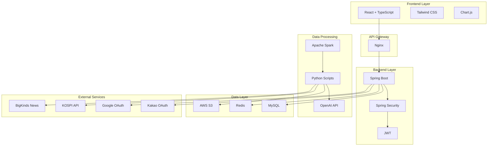
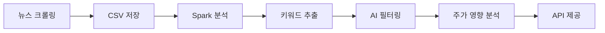

# 📈 주식 모의투자 플랫폼 - "How to Survive in the Stock Market"

<div align="center">


**주식을 잘 모르는 사람들을 위한 AI 기반 모의투자 플랫폼**

[🚀 데모 보기](https://j13a301.p.ssafy.io) | [📖 포팅 메뉴얼](./PORTING_MANUAL.md) | [🐛 이슈 신고](https://lab.ssafy.com/s13-bigdata-dist-sub1/S13P21A301/-/issues)

</div>

---

## 🎯 프로젝트 소개

### 📝 개요
"**How to Survive in the Stock Market**"는 주식 투자를 처음 시작하는 사람들을 위한 종합적인 모의투자 플랫폼입니다. 실제 돈의 부담 없이 주식 투자를 경험하고, AI 기반 분석을 통해 투자 성향을 파악할 수 있습니다.

### 🌟 주요 기능

#### 🎮 **모의투자 시스템**
- **실시간 주가 데이터**: KOSPI 200 종목 실시간 시세
- **포트폴리오 관리**: 투자 현황 및 수익률 추적
- **매매 기능**: 주문, 체결, 정정/취소 등 실제 거래와 동일한 경험

#### 🧠 **AI 기반 투자 성향 분석**
- **성향 테스트**: 15개 질문을 통한 투자 성향 진단
- **성향별 추천**: 보수형, 공격형, 균형형 등 맞춤형 투자 전략
- **학습 추천**: 성향에 맞는 주식 학습 콘텐츠 제공

#### 📊 **뉴스 키워드 분석**
- **뉴스 크롤링**: 빅카인즈 뉴스 데이터 자동 수집
- **Spark 분석**: 대용량 뉴스 데이터 키워드 빈도 분석
- **AI 필터링**: OpenAI API를 활용한 주식 관련 키워드 추출
- **주가 영향 분석**: 뉴스가 기업 주가에 미치는 영향도 분석

#### 📈 **데이터 시각화**
- **실시간 차트**: Chart.js 기반 주가 차트
- **포트폴리오 분석**: 투자 현황 및 수익률 시각화
- **키워드 트렌드**: 뉴스 키워드 빈도 및 트렌드 분석

---

## 🏗️ 시스템 아키텍처

### 📋 기술 스택

| 구분 | 기술 | 버전 | 설명 |
|------|------|------|------|
| **Frontend** | React | 19.1.1 | 사용자 인터페이스 |
| | TypeScript | 5.8.3 | 타입 안전성 |
| | Vite | 7.1.7 | 빌드 도구 |
| | Tailwind CSS | 4.1.13 | 스타일링 |
| **Backend** | Spring Boot | 3.5.5 | REST API 서버 |
| | Java | 17 | 백엔드 언어 |
| | Spring Security | - | 인증/인가 |
| | JWT | - | 토큰 기반 인증 |
| **Database** | MySQL | 8.0 | 메인 데이터베이스 |
| | Redis | - | 캐시 및 세션 |
| **Big Data** | Apache Spark | 3.4.1 | 대용량 데이터 처리 |
| | Python | 3.9+ | 데이터 분석 |
| **AI/ML** | OpenAI API | - | 키워드 분석 및 요약 |
| | Pandas | 1.5.3 | 데이터 처리 |
| | NumPy | 1.24.3 | 수치 계산 |
| **DevOps** | Docker | 20.10+ | 컨테이너화 |
| | Docker Compose | 2.0+ | 멀티 컨테이너 관리 |
| | Jenkins | - | CI/CD |
| | Nginx | - | 웹서버/리버스 프록시 |
| **Monitoring** | Prometheus | - | 메트릭 수집 |
| | Grafana | - | 모니터링 대시보드 |

### 🔄 시스템 구조



---

## 🚀 빠른 시작

### 📋 사전 요구사항

- **Docker** 20.10.0+
- **Docker Compose** 2.0.0+
- **Git** 2.25.0+
- **최소 8GB RAM** (권장 16GB+)

### ⚡ 1분 배포

```bash
# 1. 저장소 클론
git clone https://lab.ssafy.com/s13-bigdata-dist-sub1/S13P21A301.git
cd S13P21A301

# 2. 환경 변수 설정
cp env.example .env
# .env 파일을 편집하여 필요한 환경 변수 설정

# 3. 자동 배포 실행
chmod +x deploy.sh
./deploy.sh
```

### 🔧 수동 설치

```bash
# 1. 컨테이너 빌드
docker-compose build

# 2. 서비스 시작
docker-compose up -d

# 3. 상태 확인
docker-compose ps
```

### 🌐 접속 정보

| 서비스 | URL | 포트 | 설명 |
|--------|-----|------|------|
| **웹 애플리케이션** | http://localhost | 80 | 메인 애플리케이션 |
| **백엔드 API** | http://localhost:8080 | 8080 | REST API |
| **Jenkins** | http://localhost:8081 | 8081 | CI/CD |
| **Spark Master** | http://localhost:8000 | 8000 | Spark Web UI |
| **Grafana** | http://localhost:3000 | 3000 | 모니터링 |
| **Prometheus** | http://localhost:9090 | 9090 | 메트릭 |

---

## 📁 프로젝트 구조

```
S13P21A301/
├── 📁 back/                    # Spring Boot 백엔드
│   ├── src/main/java/         # Java 소스 코드
│   ├── src/main/resources/    # 설정 파일
│   ├── Dockerfile            # 백엔드 Docker 이미지
│   └── build.gradle          # Gradle 빌드 설정
│
├── 📁 frontend/               # React 프론트엔드
│   ├── src/                  # React 소스 코드
│   │   ├── components/       # 재사용 가능한 컴포넌트
│   │   ├── pages/           # 페이지 컴포넌트
│   │   ├── hooks/           # 커스텀 훅
│   │   ├── stores/          # 상태 관리 (Zustand)
│   │   └── api/             # API 클라이언트
│   ├── Dockerfile           # 프론트엔드 Docker 이미지
│   └── package.json         # NPM 의존성
│
├── 📁 news-keyword/          # 뉴스 키워드 분석 시스템
│   ├── 📁 app/              # FastAPI 키워드 서비스
│   ├── 📁 spark/            # Spark 클러스터
│   ├── 📁 news_crawl/       # 뉴스 크롤링
│   └── 📁 scripts/          # 실행 스크립트
│
├── 📁 kospi200/             # KOSPI 200 데이터 수집
│   ├── realtime_stock.py    # 실시간 주가 수집
│   └── requirements.txt     # Python 의존성
│
├── 📁 jenkins/              # Jenkins CI/CD
│   ├── Dockerfile          # Jenkins Docker 이미지
│   └── jobs/               # Jenkins Job 설정
│
├── 📁 nginx/                # Nginx 설정
│   └── app.conf            # 웹서버 설정
│
├── 📁 scripts/              # 유틸리티 스크립트
│   └── health-check.sh     # 헬스체크 스크립트
│
├── 📁 TIL/                  # 팀 학습 자료
│   └── [팀원별 폴더]/
│
├── deploy.sh               # 자동 배포 스크립트
├── Jenkinsfile            # Jenkins 파이프라인
├── env.example           # 환경 변수 템플릿
└── README.md            # 프로젝트 문서
```

---

## 🔧 환경 설정

### 🔑 필수 환경 변수

```bash
# 데이터베이스 설정
DB_NAME=survive_stock
DB_USER=root
DB_PASSWORD=your_secure_password

# JWT 설정
JWT_SECRET=your_jwt_secret_key

# OAuth 설정
KAKAO_CLIENT_ID=your_kakao_client_id
GOOGLE_CLIENT_ID=your_google_client_id

# AI 서비스 설정
OPENAI_API_KEY=your_openai_api_key

# AWS S3 설정 (키워드 분석용)
AWS_ACCESS_KEY_ID=your_aws_access_key
AWS_SECRET_ACCESS_KEY=your_aws_secret_key
```

### 🌐 OAuth 설정

#### Kakao OAuth
1. [Kakao Developers](https://developers.kakao.com/) 접속
2. 애플리케이션 생성 및 설정
3. 리다이렉트 URI 설정: `http://your-domain/api/users/auth/kakao/callback`

#### Google OAuth
1. [Google Cloud Console](https://console.cloud.google.com/) 접속
2. OAuth 2.0 클라이언트 ID 생성
3. 리다이렉트 URI 설정: `http://your-domain/api/users/auth/google/callback`

---

## 📊 주요 기능 상세

### 🎮 모의투자 시스템

#### 실시간 주가 데이터
- **KOSPI 200** 종목 실시간 시세 제공
- **WebSocket** 기반 실시간 데이터 업데이트
- **차트 분석** 도구 제공

#### 포트폴리오 관리
- **투자 현황** 실시간 모니터링
- **수익률 분석** 및 시각화
- **거래 내역** 상세 기록

### 🧠 AI 투자 성향 분석

#### 성향 테스트
```typescript
// 성향 테스트 예시
interface TendencyQuestion {
  id: number;
  question: string;
  options: TendencyOption[];
}

interface TendencyOption {
  text: string;
  score: {
    conservative: number;
    aggressive: number;
    balanced: number;
  };
}
```

#### 성향별 추천
- **보수형**: 안정적인 우량주 추천
- **공격형**: 성장주 및 테마주 추천
- **균형형**: 안정성과 수익성 균형 추천

### 📊 뉴스 키워드 분석

#### 데이터 처리 파이프라인


#### 주요 분석 기능
- **키워드 빈도 분석**: Spark를 활용한 대용량 데이터 처리
- **관련성 필터링**: OpenAI API를 통한 주식 관련 키워드 추출
- **영향도 분석**: 뉴스가 주가에 미치는 영향도 예측

---

## 🚀 배포 및 운영

### 🐳 Docker 기반 배포

#### 전체 시스템 배포
```bash
# 전체 서비스 시작
docker-compose up -d

# 특정 서비스만 시작
docker-compose up -d app web mysql redis

# 서비스 중지
docker-compose down
```

#### 개별 서비스 배포
```bash
# 백엔드만 빌드 및 실행
cd back
./gradlew bootJar
docker build -t stock-backend .

# 프론트엔드만 빌드 및 실행
cd frontend
npm run build
docker build -t stock-frontend .
```

### 🔄 CI/CD 파이프라인

#### Jenkins 파이프라인
- **자동 빌드**: GitLab push 시 자동 트리거
- **테스트 실행**: 단위 테스트 및 통합 테스트
- **Docker 이미지 빌드**: 멀티 스테이지 빌드
- **자동 배포**: 프로덕션 서버 자동 배포

#### 배포 스크립트
```bash
#!/bin/bash
# deploy.sh - 자동 배포 스크립트
set -e

echo "🚀 Stock Trading System 배포 시작..."

# 환경 변수 로드
if [ -f .env ]; then
    export $(cat .env | grep -v '^#' | xargs)
    echo "✅ 환경 변수 로드 완료"
fi

# Docker 환경 확인
if ! command -v docker &> /dev/null; then
    echo "❌ Docker가 설치되지 않았습니다"
    exit 1
fi

# 배포 실행
docker-compose down --remove-orphans || true
docker-compose build --no-cache
docker-compose up -d

# 헬스체크
./scripts/health-check.sh

echo "🎉 배포 완료!"
```

### 📊 모니터링

#### Prometheus + Grafana
- **시스템 메트릭**: CPU, 메모리, 디스크 사용률
- **애플리케이션 메트릭**: 요청 수, 응답 시간, 에러율
- **Spark 메트릭**: 작업 실행 상태, 리소스 사용률

#### 로그 관리
- **중앙화된 로깅**: 모든 서비스 로그 통합 관리
- **로그 레벨 관리**: 환경별 로그 레벨 설정
- **로그 분석**: ELK 스택을 통한 로그 분석

---

## 🧪 테스트

### 🔬 테스트 환경 설정

```bash
# 테스트 환경 실행
docker-compose -f docker-compose.test.yml up -d

# 백엔드 테스트
cd back
./gradlew test

# 프론트엔드 테스트
cd frontend
npm test
```

### 📋 테스트 커버리지

| 서비스 | 단위 테스트 | 통합 테스트 | E2E 테스트 |
|--------|-------------|-------------|------------|
| **Backend** | ✅ JUnit 5 | ✅ Spring Boot Test | ⏳ 계획 중 |
| **Frontend** | ✅ Jest | ✅ React Testing Library | ⏳ 계획 중 |
| **API** | ✅ FastAPI Test | ✅ Pytest | ⏳ 계획 중 |

---

## 🤝 기여하기

### 📝 개발 가이드라인

#### 코드 스타일
- **Backend**: Google Java Style Guide 준수
- **Frontend**: ESLint + Prettier 설정 준수
- **Python**: PEP 8 스타일 가이드 준수

#### 커밋 메시지 규칙
```
type(scope): description

feat: 새로운 기능 추가
fix: 버그 수정
docs: 문서 수정
style: 코드 포맷팅
refactor: 코드 리팩토링
test: 테스트 추가
chore: 빌드 업무 수정
```

#### 브랜치 전략
```
main          # 프로덕션 브랜치
develop       # 개발 브랜치
feature/*     # 기능 개발 브랜치
hotfix/*      # 긴급 수정 브랜치
release/*     # 릴리즈 브랜치
```

### 🐛 버그 신고

버그를 발견하셨나요? [이슈를 생성](https://lab.ssafy.com/s13-bigdata-dist-sub1/S13P21A301/-/issues)해 주세요.

### 💡 기능 제안

새로운 기능 아이디어가 있으시나요? [토론 게시판](https://lab.ssafy.com/s13-bigdata-dist-sub1/S13P21A301/-/issues)에서 논의해 주세요.

---

## 📚 문서 및 자료

### 📖 추가 문서
- [📋 포팅 메뉴얼](./PORTING_MANUAL.md) - 상세한 배포 및 운영 가이드
- [🔧 API 문서](./docs/API.md) - REST API 명세서
- [🎨 UI/UX 가이드](./docs/UI_GUIDE.md) - 디자인 시스템 가이드
- [🗄️ 데이터베이스 설계](./docs/DATABASE.md) - ERD 및 테이블 설계

### 🎥 데모 영상
- [🎬 전체 시스템 데모](https://youtu.be/demo)
- [📊 AI 분석 기능 데모](https://youtu.be/ai-demo)
- [🚀 배포 과정 데모](https://youtu.be/deploy-demo)

### 📚 학습 자료
- [📈 주식 투자 기초](https://example.com/stock-basics)
- [🤖 AI 투자 분석](https://example.com/ai-investment)
- [⚡ Spark 빅데이터 처리](https://example.com/spark-bigdata)

---

## 📄 라이선스

이 프로젝트는 **MIT 라이선스** 하에 배포됩니다. 자세한 내용은 [LICENSE](./LICENSE) 파일을 참조하세요.

---

## 👥 팀 소개

### 🏆 S13P21A301 팀

| 역할 | 이름 | 담당 영역 |
|------|------|-----------|
| **팀장** | 김종재 | 프로젝트 관리, 백엔드 개발, CI/CD, 인프라 |
| **백엔드** | 김대정, 지성현 | Spring Boot, API 개발 |
| **프론트엔드** | 장동현 | React, UI/UX 개발 |
| **빅데이터** | 정연수 | Spark, 데이터 분석 |
| **AI/ML** | 이상용 | OpenAI API, 키워드 분석 |
| **DevOps** | 김종재 | Docker, CI/CD, 인프라 |

### 🙏 감사의 말

이 프로젝트는 다음과 같은 오픈소스 프로젝트들의 도움을 받아 개발되었습니다:
- [Spring Boot](https://spring.io/projects/spring-boot)
- [React](https://reactjs.org/)
- [Apache Spark](https://spark.apache.org/)
- [Docker](https://www.docker.com/)
- [OpenAI](https://openai.com/)

---

## 📞 문의 및 지원

### 📧 연락처
- **이메일**: s13p21a301@ssafy.com
- **GitLab**: [프로젝트 저장소](https://lab.ssafy.com/s13-bigdata-dist-sub1/S13P21A301)
- **이슈 트래커**: [Issues](https://lab.ssafy.com/s13-bigdata-dist-sub1/S13P21A301/-/issues)

### 💬 커뮤니티
- **토론 게시판**: [Discussions](https://lab.ssafy.com/s13-bigdata-dist-sub1/S13P21A301/-/issues)
- **위키**: [프로젝트 위키](https://lab.ssafy.com/s13-bigdata-dist-sub1/S13P21A301/-/wikis)

---

<div align="center">

**⭐ 이 프로젝트가 도움이 되었다면 Star를 눌러주세요!**


**🚀 함께 주식 투자의 세계를 탐험해보세요!**

</div>
