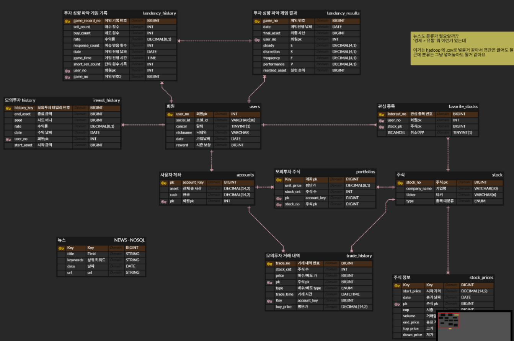
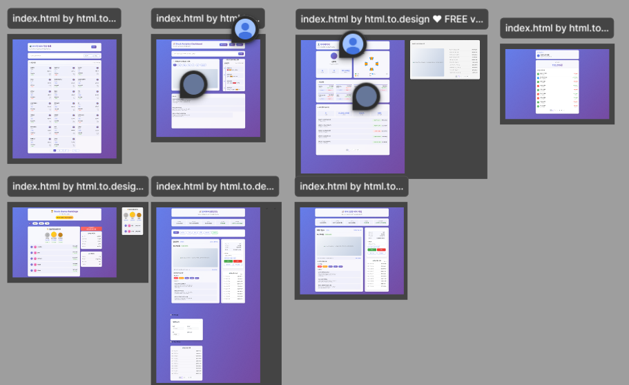

# TIL - 2025.09.04 (목)

## 📌 오늘 학습한 내용 요약
1. 프로젝트 기획
2. UI 및 와이어프레임
3. erd 설계 최종 (일단?)

## 🧠 상세 내용 정리

## 🤔 느낀 점 & 회고
1. 디자인은 너무나도 어려운 것이다..
2. 테이블 세팅은 너무나도 어려운 것이다..
    - 어떤 컬럼이 필요하고, 정규화, 반정규화를 지키고 적절한 자료형을 사용하고 생각해야 할게 너무나도 많다..

## 📝 내일 할 일
1. erd 설계를 바탕으로 팀 미팅
2. 미팅에서 혼나고 erd 재설계 하지 않을까 싶음
3. 끝나고 정처기 DB 파트 공부