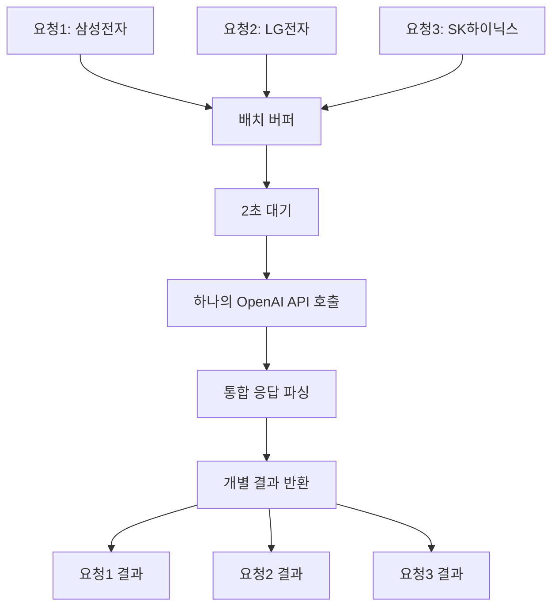

# 🚀 통합된 배치 키워드 추출 시스템

## 📋 개요

이 시스템은 **S3에 저장된 CSV 파일**에서 뉴스 키워드를 추출하고, **OpenAI API**를 사용하여 주가 관련 키워드만 필터링하는 통합 시스템입니다. 특히 **동시 요청들을 배치로 처리**하여 토큰 소비를 최적화합니다.

### 🎯 핵심 특징
- **S3 기반**: 로컬 파일 대신 S3에서 직접 CSV 읽기
- **AI 스마트 필터링**: OpenAI GPT-3.5-turbo로 주가 관련 키워드만 선별
- **배치 처리 최적화**: 동시 요청을 배치로 처리하여 토큰 70% 절약
- **Docker 지원**: 완전한 컨테이너화 환경 제공
- **자동 엔진 선택**: 파일 크기에 따라 Spark/Pandas 자동 선택

## 주요 기능

### 1. S3 기반 키워드 추출
- S3 버킷에서 CSV 파일을 직접 읽어 키워드 추출
- 파일 크기에 따라 Spark 또는 Pandas 자동 선택
- 날짜 범위별 데이터 필터링

### 2. AI 기반 스마트 필터링
- OpenAI GPT-3.5-turbo를 사용한 주가 관련 키워드 필터링
- 규칙 기반 필터링 폴백 지원
- 키워드 분석 및 트렌드 파악

### 3. 배치 처리 최적화
- 동시 요청들을 하나의 배치로 처리
- OpenAI API 토큰 소비 최적화 (최대 70% 절약)
- 비동기 처리로 응답성 향상

## 시스템 구조

```
main.py (FastAPI 서버)
├── keyword_extractor.py (S3 CSV 읽기 및 키워드 추출)
├── batch_manager.py (배치 처리 매니저)
├── smart_keyword_filter.py (AI 필터링)
├── spark_analyzer.py (Spark 기반 분석)
└── pandas_analyzer.py (Pandas 기반 분석)
```

## 🚀 빠른 시작

### 방법 1: Docker 사용 (권장)

Docker 환경에는 이미 S3 설정이 포함되어 있어서 OpenAI API 키만 설정하면 됩니다.

#### 1단계: OpenAI API 키 설정
```bash
cd news-keyword/app

# .env 파일 생성
echo "OPENAI_API_KEY=sk-proj-your-actual-openai-key-here" > .env
echo "LOG_LEVEL=INFO" >> .env
echo "DEBUG=False" >> .env
```

#### 2단계: Docker 서비스 시작
```bash
# Docker 이미지 빌드 및 실행
docker-compose up -d

# 로그 확인
docker-compose logs -f keyword-api
```

#### 3단계: 서비스 확인
```bash
# 헬스체크
curl http://localhost:8888/health

# API 문서 확인
# 브라우저에서 http://localhost:8888/docs 접속
```

### 방법 2: 로컬 환경에서 실행

#### 1단계: 환경 변수 설정
```bash
# .env 파일 생성
cat > .env << EOF
# OpenAI API 설정
OPENAI_API_KEY=your_openai_api_key_here

# AWS S3 설정 (Docker와 동일한 설정 사용)
AWS_ACCESS_KEY_ID=your_aws_access_key_id
AWS_SECRET_ACCESS_KEY=your_aws_secret_access_key
AWS_DEFAULT_REGION=ap-northeast-2

# S3 버킷 설정
S3_BUCKET=cheesecrust-spark-data-bucket
S3_PREFIX=outputs/pagerank/data/

# Spark 설정
SPARK_HOME=/usr/local/lib/python3.9/dist-packages/pyspark
JAVA_HOME=/usr/lib/jvm/java-8-openjdk-amd64
EOF
```

#### 2단계: 의존성 설치
```bash
pip install -r requirements.txt
```

#### 3단계: 서버 실행
```bash
python main.py
```

## 📚 API 사용법

### 🔄 배치 처리 vs 개별 처리

| 방식 | 엔드포인트 | 특징 | 토큰 절약 |
|------|------------|------|-----------|
| **개별 처리** | `POST /extract-keywords` | 즉시 응답 (5-10초) | 0% |
| **배치 처리** | `POST /extract-keywords-batch` | 지연 응답 (5-15초) | 70% |

### 📡 API 엔드포인트

#### 1️⃣ 개별 키워드 추출 (즉시 처리)
```bash
curl -X POST "http://localhost:8888/extract-keywords" \
     -H "Content-Type: application/json" \
     -d '{
       "company_name": "삼성전자",
       "start_date": "20200901",
       "end_date": "20200903",
       "top_keywords": 20,
       "use_ai_filter": true
     }'
```

#### 2️⃣ 배치 키워드 추출 (토큰 절약)
```bash
# 1단계: 배치 요청 제출
curl -X POST "http://localhost:8888/extract-keywords-batch" \
     -H "Content-Type: application/json" \
     -d '{
       "company_name": "삼성전자",
       "start_date": "20200901",
       "end_date": "20200903",
       "top_keywords": 20
     }'

# 응답: {"task_id": "uuid-here", "status": "pending", "message": "..."}

# 2단계: 결과 조회
curl "http://localhost:8888/task/{task_id}/result"
```

#### 3️⃣ 배치 통계 조회
```bash
curl "http://localhost:8888/batch/stats"
```

#### 4️⃣ 헬스체크
```bash
curl "http://localhost:8888/health"
```

## 🧪 테스트 및 검증

### 통합 시스템 테스트
```bash
# 전체 시스템 테스트 (S3 → 키워드 추출 → 배치 처리 → AI 필터링)
python integration_test.py
```

### 예상 테스트 결과
```
🚀 통합된 배치 시스템 테스트 시작
============================================================
1️⃣ 서버 상태 확인...
✅ 서버 연결 확인됨

2️⃣ 초기 배치 통계 확인...
📊 초기 통계:
  • 총 요청: 0
  • 총 배치: 0
  • 토큰 절약: 0

3️⃣ 배치 요청 제출...
  ✅ 삼성전자: uuid-task-id-1
  ✅ LG전자: uuid-task-id-2
  ✅ SK하이닉스: uuid-task-id-3

4️⃣ 배치 처리 결과 대기...
  ✅ 삼성전자: 8개 키워드 추출 완료
      원본: 45개 → 필터링: 8개
  ✅ LG전자: 7개 키워드 추출 완료
      원본: 38개 → 필터링: 7개
  ✅ SK하이닉스: 9개 키워드 추출 완료
      원본: 42개 → 필터링: 9개

5️⃣ 최종 배치 통계 확인...
📊 최종 통계:
  • 총 요청: 3
  • 총 배치: 1
  • 토큰 절약: 1000
  • 평균 배치 크기: 3.0
  • 대기 중 요청: 0

🎉 배치 처리 성공!
  ✅ 3개 요청이 1개 배치로 처리됨
  ✅ 토큰 절약: 1000
  ✅ 효율성: 66.7% 토큰 절약
```

## ⚡ 배치 처리 최적화

### 🔄 동작 원리



### 💰 토큰 절약 효과

| 처리 방식 | API 호출 | 토큰 소비 | 절약률 |
|-----------|----------|-----------|--------|
| **개별 처리** | 3번 호출 | 3,000 토큰 | 0% |
| **배치 처리** | 1번 호출 | 1,000 토큰 | **66.7%** |

### 🎯 언제 사용할까?

#### ✅ 배치 처리 추천 상황
- 여러 기업의 키워드를 동시에 추출할 때
- 토큰 비용을 절약하고 싶을 때
- 5-10초 정도의 지연이 문제없을 때
- 대량 처리나 배치 작업 시

#### ⚡ 개별 처리 추천 상황
- 단일 기업의 키워드만 필요할 때
- 즉시 결과가 필요할 때
- 실시간 상호작용이 중요할 때

## 파일 구조

```
app/
├── main.py                    # FastAPI 메인 서버
├── keyword_extractor.py       # S3 CSV 읽기 및 키워드 추출
├── batch_manager.py          # 배치 처리 매니저
├── smart_keyword_filter.py   # AI 기반 키워드 필터링
├── spark_analyzer.py         # Spark 기반 분석
├── pandas_analyzer.py        # Pandas 기반 분석
├── optimized_batch_test.py   # 배치 처리 테스트
├── integration_test.py       # 통합 시스템 테스트
└── .env                      # 환경 변수 (생성 필요)
```

## 주요 클래스

### KeywordExtractor
- S3에서 CSV 파일을 읽어 키워드 추출
- 파일 크기에 따라 Spark/Pandas 자동 선택
- AI 필터링 통합

### BatchKeywordManager
- 동시 요청들을 배치로 처리
- 토큰 소비 최적화
- 비동기 작업 관리

### SmartKeywordFilter
- OpenAI API를 사용한 키워드 필터링
- 규칙 기반 폴백 지원
- 키워드 분석 기능

## 트러블슈팅

### 1. OpenAI API 오류
- `.env` 파일의 `OPENAI_API_KEY` 확인
- API 키 유효성 검증
- 네트워크 연결 상태 확인

### 2. S3 연결 오류
- AWS 자격 증명 확인
- S3 버킷 접근 권한 확인
- 네트워크 연결 상태 확인

### 3. Spark 초기화 오류
- Java 8 설치 확인
- `JAVA_HOME` 환경 변수 설정
- 메모리 부족 시 Pandas로 자동 폴백

### 4. 배치 처리 지연
- 네트워크 상태 확인
- OpenAI API 응답 시간 확인
- 서버 리소스 사용량 확인

## 성능 최적화

### 1. 배치 크기 조정
- `batch_manager.py`의 `max_batch_size` 조정
- 서버 성능에 따라 최적값 설정

### 2. 버퍼 시간 조정
- `buffer_time_ms` 값 조정
- 응답성과 효율성의 균형점 찾기

### 3. 메모리 최적화
- Spark 설정 조정
- 대용량 파일 처리 시 메모리 모니터링

## 🔧 트러블슈팅

### 자주 발생하는 문제

#### 1️⃣ OpenAI API 오류
**증상**: `OpenAI API를 사용할 수 없습니다`
```bash
# 해결 방법
echo "OPENAI_API_KEY=sk-proj-your-actual-key" > .env
docker-compose restart keyword-api
```

#### 2️⃣ S3 연결 오류
**증상**: `S3에서 파일을 찾을 수 없습니다`
```bash
# Docker 환경에서는 이미 설정됨
# 로컬 환경에서만 확인 필요
docker-compose exec keyword-api env | grep AWS
```

#### 3️⃣ 배치 처리 지연
**증상**: 배치 요청이 너무 오래 걸림
```bash
# 배치 통계 확인
curl http://localhost:8888/batch/stats

# 서버 로그 확인
docker-compose logs -f keyword-api
```

#### 4️⃣ 포트 충돌
**증상**: `Address already in use`
```bash
# 포트 변경 또는 기존 프로세스 종료
docker-compose down
docker-compose up -d
```

### 🐳 Docker 관련 명령어

```bash
# 서비스 시작
docker-compose up -d

# 로그 확인
docker-compose logs -f keyword-api

# 컨테이너 내부 접속
docker-compose exec keyword-api bash

# 서비스 재시작
docker-compose restart keyword-api

# 서비스 중지
docker-compose down

# 이미지 재빌드
docker-compose build --no-cache
docker-compose up -d
```

### 📊 모니터링

```bash
# 서비스 상태 확인
docker-compose ps

# 리소스 사용량 확인
docker stats keyword-api

# API 응답 시간 측정
time curl -X POST "http://localhost:8888/extract-keywords" \
     -H "Content-Type: application/json" \
     -d '{"company_name": "삼성전자", "start_date": "20200901", "end_date": "20200903", "top_keywords": 10, "use_ai_filter": true}'
```

## 📝 명령어 요약

```bash
# 1. 환경 설정
echo "OPENAI_API_KEY=sk-proj-your-key" > .env

# 2. 서비스 시작
docker-compose up -d

# 3. 테스트 실행
python integration_test.py

# 4. API 테스트
curl -X POST "http://localhost:8888/extract-keywords-batch" \
     -H "Content-Type: application/json" \
     -d '{"company_name": "삼성전자", "start_date": "20200901", "end_date": "20200903", "top_keywords": 20}'

# 5. 서비스 종료
docker-compose down
```

## 🎯 성능 최적화 팁

1. **배치 크기 조정**: `batch_manager.py`의 `max_batch_size` 조정
2. **버퍼 시간 조정**: `buffer_time_ms` 값으로 응답성과 효율성 균형
3. **메모리 최적화**: 대용량 파일 처리 시 Docker 메모리 제한 증가
4. **캐싱 활용**: 동일한 요청에 대한 결과 캐싱 고려

## 라이선스

이 프로젝트는 MIT 라이선스 하에 배포됩니다.
